# STAT 540 - Seminar 1: Introduction to Git and GitHub

## Learning Objectives

By the end of this seminar, you should

-   Have a conceptual understanding of what version control is and why
    it is important
-   be able to describe the differences and relationships between Git,
    GitHub, and Git Client
-   Have some familiarity with the GitHub browser interface and be able
    to use some of its basic features such as navigating the contents of
    a repository and creating issues
-   Have your environment set up for using Git and GitHub
-   Have practical experience with the routine Git workflow: Create,
    Clone, Stage, Commit, Push, and Pull

## Part 1: What is Version Control? Git? GitHub? Git Client?

All these terms might seem a little daunting at first, but don’t worry,
all these things were invented to make things easier for you. There is a
bit of a learning curve if you have no previous experience, but rest
assured, this seminar has been carefully designed to walk you through
everything you need to know.

### Git Basics

Version control is one of the key tools in the software engineer’s
toolbox. According to [The
Guardian](https://www.theguardian.com/technology/blog/2008/aug/19/howmanypeoplemakewindows7),
\>900 developers contributed to the development of Microsoft’s Windows
7. When you have that many people working on a single project, imagine
how many times the code base would be changed within a single day, or
even a single hour? And by who? And for what? What happens if more than
two developers change a single file at the same time? Or even a single
line of code?

A version control system provides a structured way for maintaining a
clean and easily accessible track record of how a directory of files
(most commonly the source code of some software application) evolves
through time. It also provides important mechanisms for resolving issues
when they arise, such as when two developers try to make conflicting
changes to a single file.

Git is just one of many version control systems out there, albeit a
(very) popular one. Others include
[Mercurial](https://www.mercurial-scm.org/),
[Perforce](https://www.perforce.com/),
[Subversion](https://subversion.apache.org/), etc.

Watch this [video](https://git-scm.com/video/what-is-version-control)
for some Git Basics.

### Why Git? (excerpt from [section 1.1 of Happy Git and GitHub for the useR](http://happygitwithr.com/big-picture.html#why-git))

Git is a version control system. Its original purpose was to help groups
of developers work collaboratively on big software projects. Git manages
the evolution of a set of files – called a repository – in a sane,
highly structured way. If you have no idea what I’m talking about, think
of it as the “Track Changes” features from Microsoft Word on steroids.

Git has been re-purposed by the data science community. In addition to
using it for source code, we use it to manage the motley collection of
files that make up typical data analytical projects, which often consist
of data, figures, reports, and, yes, source code.

### Why GitHub? (excerpt from [section 1.2 of Happy Git and GitHub for the useR](http://happygitwithr.com/big-picture.html#why-github))

This is where hosting services like GitHub, Bitbucket, and GitLab come
in. They provide a home for your Git-based projects on the internet. If
you have no idea what I’m talking about, think of it as DropBox but
much, much better. The remote host acts as a distribution channel or
clearinghouse for your Git-managed project. It allows other people to
see your stuff, sync up with you, and perhaps even make changes. These
hosting providers improve upon traditional Unix Git servers with
well-designed web-based interfaces.

But be careful, while GitHub and many other services are great for
tracking files, they may not always have the capacity to store large
amounts of data. GitHub recommends that repositories are under the size
of 1GB (see this github
[help](https://help.github.com/articles/what-is-my-disk-quota/) page).
More importantly, GitHub doesn’t allow for files larger than 100MB in
size (see [Working with large
files](https://help.github.com/articles/working-with-large-files/)).

Even for private solo projects, it’s a good idea to push your work to a
remote location for peace of mind. Why? Because it’s fairly easy to
screw up your local Git repository, especially when you’re new at this.
The good news is that often only the Git infrastructure is backed up.
Your files are just fine! Which makes your Git pickle all the more
frustrating. There are official Git solutions to these problems, but
they might require expertise and patience you can’t access at 3a.m. If
you’ve recently pushed your work to GitHub, it’s easy to grab a fresh
copy, patch things up with the changes that only exist locally, and get
on with your life.

We target GitHub – not Bitbucket or GitLab – for the sake of
specificity. However, all the big-picture principles and even some
mechanics will carry over to these alternative hosting platforms.

### Wait, so what is what, exactly?

***Version control*** is the general term used to refer to software
systems that helps you “manage” your files, most commonly being code
bases. As already mentioned, Git is just one of many version control
systems out there. Other examples include
[Mercurial](https://www.mercurial-scm.org/),
[Perforce](https://www.perforce.com/),
[Subversion](https://subversion.apache.org/), etc.

***Git*** is the version control software. Both the GitHub server and
your computer run it. It is what enables your laptop to talk with the
remote repository stored on GitHub, and enables version control features
like pushing and pulling code changes, keeping history, etc.

***GitHub*** is the service in the cloud that stores your remote
repository. When you’re working in a group, you and your collaborators
will independently interact with GitHub in order to pull/publish your
latest code changes. It will hold the most up-to-date “truth” of your
project directory with each of you working away on your local machines.

***Git Client*** is a piece of software that provides a graphical user
interface that facilitates your interaction with Git. In our case, **we
will be using RStudio’s built-in Git Client**. Other options include
[SourceTree](https://www.sourcetreeapp.com/) and [GitHub
Desktop](https://desktop.github.com/). And of course, the terminal is
the most powerful (but also the most difficult if you’re not used to
command line interfaces) way to use Git.

## Part 2: Set up your environment

Before we can start using Git, your computer must be equipped with the
appropriate software. In this section, we will walk you through: 1.
Installing Git, 2. Registering for a GitHub account, 3. Setting up an
SSH key, 4. Talking to Git via RStudio.

### 1. Install Git (contains excerpts from [Ch. 7 of Happy Git and GitHub for the useR](http://happygitwithr.com/install-git.html))

You need Git, so you can use it at the command line and so RStudio can
call it. If there’s any chance it’s installed already, verify that,
rejoice, and skip this step. Otherwise, find installation instructions
below for your operating system.

#### Is Git already installed?

Open the shell (terminal / command line). Type in `git --version`, no
quotation, press enter.

``` bash
git --version
## git version 2.33.1
```

If you see something like `git: command not found`, proceed to the
instructions for installation based on your operating system.

If you see a printout of the version number as shown above, this means
you have Git already. Great! But wait. Is the version number \< 2.28? If
so, I recommend that you update it (follow the install instructions
based on your operating system below). The reason you should update if
you have an older version of Git is that newer versions allow us to
configure the default branch name. There is a movement in the Git
community to [rename the default branch of repositories from ‘master’ in
favor of the neutral and inclusive term
‘main’](https://github.com/github/renaming), as ‘master’ has offensive
connotations. [GitHub has made the change to default new branch names as
main](https://www.bbc.com/news/technology-53050955). With older versions
of git, the default branch will always be ‘master’, so each time you
create a new repo you’ll have to rename the local default branch to
avoid conflicts with the GitHub default. With a newer version (2.28 and
later) you can set it once and you’re good to go for all new repos.

Otherwise, if you have a current version of Git installed, you can skip
the next step!

#### Install Git for Windows people

Install [Git for Windows](https://git-for-windows.github.io/),
previously known as msysgit or “Git Bash”, to get Git in addition to
some other useful tools, such as the Bash shell. Yes, all those names
are totally confusing. You may accept all the default settings during
installation.

-   This approach leaves the Git executable in a conventional location,
    which will help you and other programs, e.g. RStudio, find it and
    use it. This also supports a transition to more expert use, because
    the Bash shell will be useful as you venture outside of R/RStudio.
-   This also leaves you with a Git client, though not a very good one.
-   RStudio for windows likes for git to be in the Files(x86) folder. If
    not in this location, RStudio may not detect it, and may cause
    headaches for you later.

#### Install Git for Mac people

First install the Xcode command line tools (not all of Xcode), which
includes Git by opening a terminal and typing in the following and press
enter. Follow prompts.

``` bash
xcode-select --install
```

Verify that Xcode command line tools has been installed by typing the
following into the terminal and press enter.

``` bash
xcode-select --version
## xcode-select version 2384.
```

Enter one of these commands to elicit an offer to install developer
command line tools:

``` bash
git --version
git config
```

Accept the offer! Click on “Install”.

If the Xcode method isn’t successful for you, you can install git from
here: <http://git-scm.com/downloads>. Or you can try this command if you
use Homebrew:

``` bash
brew install git
```

Verify that you’re ready to go by running the `git --version` command
once again.

Additionally if you’ve updated your git version, save yourself some
potential headache and [make sure that RStudio is pointing to the
correct version of git](https://happygitwithr.com/rstudio-see-git.html).

#### Install Git for Linux people

Install Git via your distro’s package manager.

Ubuntu or Debian Linux:

``` bash
sudo apt-get install git
```

Fedora or RedHat Linux:

``` bash
sudo yum install git
```

[A comprehensive list](https://git-scm.com/download/linux) for various
Linux and Unix package managers.

### 2. Register for a GitHub account (contains excerpts from [Ch. 5 of Happy Git and GitHub for the useR](http://happygitwithr.com/install-git.html))

If you don’t have a GitHub account already, register for one at
[GitHub](https://github.com). It’s free!

A few tips on selecting a username, which sadly tend to contradict each
other:

-   Incorporate your actual name! People like to know who they’re
    dealing with. Also makes your username easier for people to guess or
    remember.
-   Reuse your username from other contexts, e.g., Twitter or Slack if
    it’s available.
-   Pick a username you will be comfortable revealing to your future
    boss.
-   Shorter is better than longer.
-   Be as unique as possible in as few characters as possible. In some
    settings GitHub auto-completes or suggests usernames.
-   Make it timeless. Don’t highlight your current university, employer,
    or place of residence.
-   Avoid words laden with special meaning in programming. In my first
    inept efforts to script around the GitHub API, I assigned lots of
    issues to the guy with username NA because my vector of GitHub
    usernames contained missing values. A variant of Little Bobby
    Tables.

You can change your username later, but better to get this right the
first time.

-   [Changing your GitHub
    username](https://help.github.com/articles/changing-your-github-username/)
-   [What happens when I change my
    username?](https://help.github.com/articles/what-happens-when-i-change-my-username/)

### 3. Introduce yourself to Git (contains excerpts from [Ch 8](http://happygitwithr.com/hello-git.html) of [Happy Git and GitHub for the useR](http://happygitwithr.com/))

First, you want to introduce yourself to Git. The information you enter
here will constitute the user stamp for each commit you make. That way,
Git can trace back code changes to their authors. This only needs to be
done once.

In the shell/terminal:

``` bash
git config --global user.name 'your_github_username'
git config --global user.email 'your_email_adress'
git config --global --list
```

substituting your github username and the email associated with your
GitHub account.

### 4. Generate a Personal access token for HTTPS (contains excerpts from [Ch 9](https://happygitwithr.com/https-pat.html) of [Happy Git and GitHub for the useR](http://happygitwithr.com/))

When we interact with a remote Git server, such as GitHub, we have to
include credentials in the request. This proves we are a specific GitHub
user, who’s allowed to do whatever we’re asking to do.

Git can communicate with a remote server using one of two protocols,
HTTPS or SSH, and the different protocols use different credentials.

Here we describe the credential setup for the HTTPS protocol, which is
what we recommend if you have no burning reason to pick SSH (if so, head
to [Ch 10 of Happy Git and GitHub for the
useR](https://happygitwithr.com/ssh-keys.html)). With HTTPS, we will use
a personal access token (PAT).

Let it be known that the password that you use to login to GitHub’s
website is NOT an acceptable credential when talking to GitHub as a Git
server. This was possible in the past (and may yet be true for other Git
servers), but those days are over at GitHub. You can learn more in their
blog post [Token authentication requirements for Git
operations](https://github.blog/2020-12-15-token-authentication-requirements-for-git-operations/).

Here’s the error you’ll see if you try to do that now:

    remote: Support for password authentication was removed on August 13, 2021. Please use a personal access token instead.
    remote: Please see https://github.blog/2020-12-15-token-authentication-requirements-for-git-operations/ for more information.
    fatal: Authentication failed for 'https://github.com/OWNER/REPO.git/'

This is a very minimal account of getting and storing a PAT. This might
be all you need when you’re first getting yourself set up. If you run
into trouble, ask a TA, and refer to the detailed description in [Ch 9
of Happy Git and GitHub for the
useR](https://happygitwithr.com/https-pat.html).

Go to <https://github.com/settings/tokens> and click “Generate token”.

Look over the scopes; I highly recommend selecting “repo”, “user”, and
“workflow”.

Click “Generate token”.

Copy the generated PAT to your clipboard. Leave that browser window open
and available for a little while, so you can come back to copy the PAT.
**Once you close the window, you won’t be able to see the PAT** (but you
can generate a new one). You’ll want to store the PAT securely, like in
a password manager (NOT in a repo that gets pushed to GitHub!!) so you
can reuse it until it expires.

Provide this PAT next time a Git operation asks for your password (this
should be when we are ready to perform the push step).

You should be able to work with GitHub now, i.e. push and pull, without
reentering the PAT each time (until the PAT expires, at which point
you’ll need to reauthenticate with a new one).

#### Set the default branch name to main

Finally, we’ll set the global option for all new repositories to use a
default branch name of main.

``` bash
git config --global init.defaultBranch main
```

If this command is successful, great! Move on to Part 3.

Note that this command will only work for Git versions 2.28 and higher,
so if your version is older, you’ll have to **rename the default branch
each time you create a new repo.** Here’s how to do that.

Option 1: You can do this on the command line (from within the new
repo):

``` bash
git branch -M main
```

Option 2: In an RStudio project for the new repo, run the following line
of R code, which uses the `usethis` package:

``` r
# install usethis first if it's not already installed
install.packages("usethis")
# rename default branch from master to main 
usethis::git_default_branch_rename(to = "main")
```

## Part 3: Create, Clone, Stage, Commit, Push, Pull!

Now, we’re ready to start using Git.

The six verbs in the title will likely encompass 90% of everything you
will do with Git. We will now walk through each one to give a brief
explanation and demo.

Note that everything that can be done using RStudio (or any other Git
Client), can also be done via the shell. Here we provide instructions
for RStudio environment for a more guided experience.

If you’re interested, check out [this
post](http://dont-be-afraid-to-commit.readthedocs.io/en/latest/git/commandlinegit.html)
on using Git in the shell. It is definitely a worthwhile learning
experience if you want to dive deeper into the Git world.

### Overview

A repository is simply a directory for your project. It is no different
from any other directories on your laptop, except that Git knows about
it and keeps a complete historical record of every change that has been
“committed”.

When a repository is stored on GitHub, it is called the “remote”
repository. You can then “clone” this repository onto your laptop. The
copy on your laptop is then called the “local” repository. “Pushing” and
“pulling” are operations for keeping the local and remote repositories
in sync with each other.

For example, You can modify codes in your “local” repository and then,
when ready, “push” your changes to the “remote” repository on GitHub.
Your group members can then “pull” the most up-to-date version of the
“remote” repository from GitHub into their “local” repositories and
continue to work on the project.

Don’t worry if you don’t understand every detail of the workflow just
yet. Just get the overall picture for now. You’ll gain a much deeper
understanding once we start trying things out for real, starting now!

We are going to start by creating a brand new repository for this
seminar. We will use this repository to illustrate how to start an
assignment for this course. To complete the deliverable for this
seminar, follow these steps to push new files to this repository.

### Create a new assignment repository

Here we are going to create a new **assignment** repository. To start a
new assignment, you’ll need an assignment invite link. You’ll have one
of these for each individual deliverable, and one for the group project.
You can find these in Canvas.

Log into Canvas and navigate to our course page. Go to the Assignments
tab, and find the ‘Seminar 1’ item - click on it.

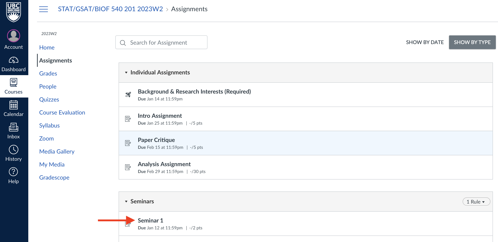

Click on the invite link for the Seminar 1 assignment.

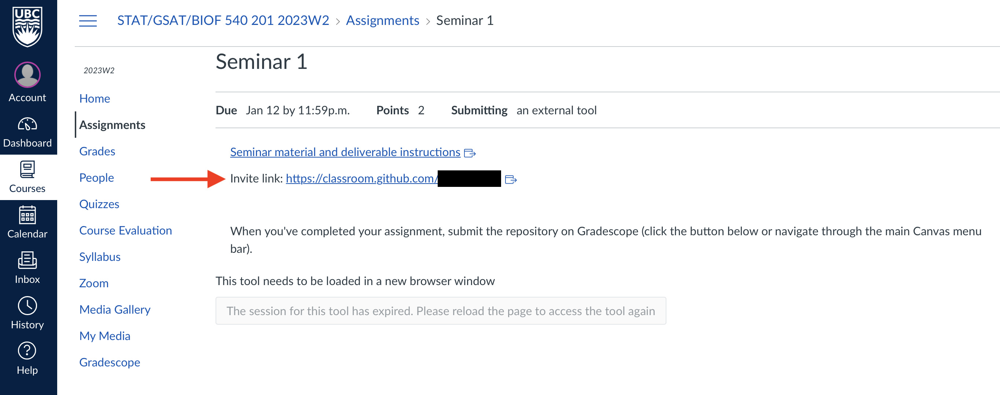

You’ll be prompted to login to GitHub if you’re not already logged in.
Then you’ll be taken to a page that invites you to accept the
assignment. Click the green “Accept this assignment” button.

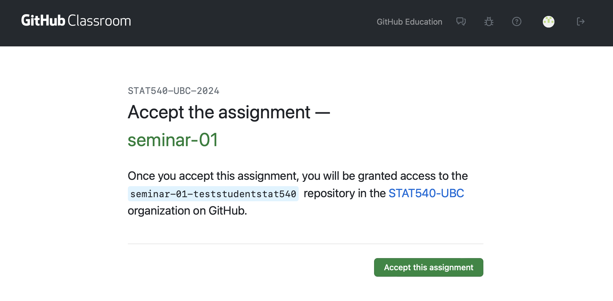

If all goes well, you’ll arrive at the ‘creating repo’ page. This could
take a few minutes if the assignment contains a lot of files, but in
most cases should be almost instantaneous. So go ahead and refresh your
browser.


When your repo is ready, you’ll see a page that has a link to it. Note
that the assignment due date is listed.

 Follow the link. Congratulations!
This is the web page of your new repository on Github. Using the GitHub
website, you will be able to browse your files directly inside of an
internet browser (although so far it is empty since we haven’t added any
files). Notice that this repo is labeled ‘Private’. It is only
accessible to you, and to the teaching team. No one else can see it.
You’ll get to shared repositories when we start the group projects.

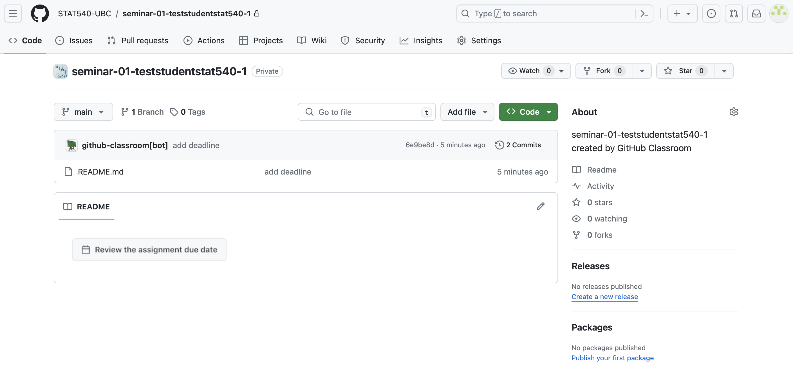

If you cannot create a repository, get help from one of the TAs.

*This step is specific to this course. If instead you would like to
create a general new repository (that is not an assignment for this
course), simply click the “New repository” button on your home screen
when you are logged into GitHub. When you create a new repository in
this way, you can choose to make it private to only yourself (with the
option to add specific collaborators if you choose), or public to
showcase your work to the public.*

### Clone

Next, we want to clone this repository into your laptop so that you have
a local copy of the repository. This is how you can make changes to the
repository on your machine.

Make sure you have the latest version of RStudio installed before you
start.

Copy the https URL from your GitHub repository website. It will be
something like
`https://github.com/STAT540-UBC-2022/seminar-01-yourgithubID.git` See
below.


**Important Note:** Unlike in this example, where we started with an
empty repository, for some future deliverables, the repository created
for you will already contain files. In that case, **to find the
“repository URL”, locate the green “Code” button on the upper right
corner of the file list as shown below.**

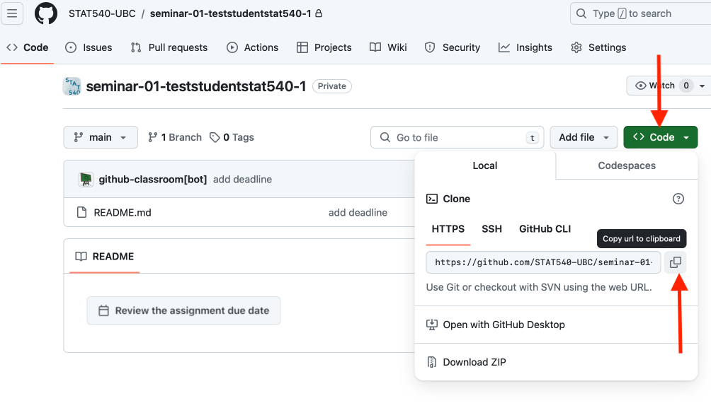

Next, in RStudio, start a new Project:

-   File > New Project > Version Control > Git. In the “repository URL”
    paste the URL of your new GitHub repository.

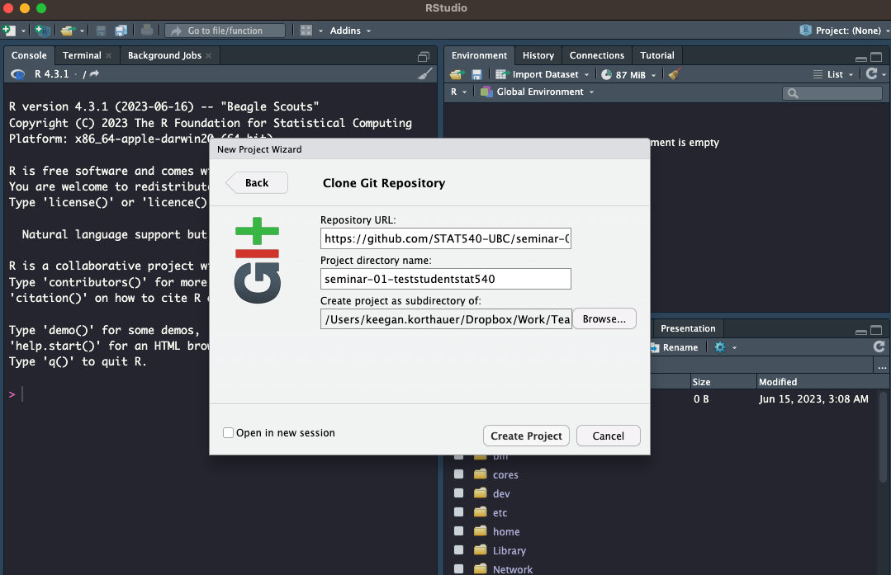

Do you NOT see an option to get the Project from Version Control? Go to
[chapter 14 of Happy Git and GitHub for the
useR](http://happygitwithr.com/rstudio-see-git.html) for tips on how to
help RStudio find Git.

Take charge of – or at least notice! – the local directory for the
Project. A common rookie mistake is to have no idea where you are saving
files or what your working directory is. Pay attention. Be intentional.
Personally, I would organize all your repos for this course in one
directory, with subfolders for seminars, homework, project, etc.

Check “Open in new session” so that RStudio will open your new project
in a new window. Click “Create Project”.

Confirm that a new directory has been created with the project directory
name you specified. The directory now contains a .Rproj file. This is
the RStudio project file. We will subsequently push this file to the
remote repository.

Also note that a new RStudio window has been opened for you as a
workspace. Notice the “Git” tab in your RStudio window.


Congratulations, again! You have cloned the Git repository onto your
local machine. Well done!

Notice that the project directory current contains nothing except for
the automatically generated .Rproj and .gitignore file. Ignore this last
file for now, we will talk about it later (ignore .gitignore, ha! It’s
okay, you don’t have to laugh). This is not very exciting yet at all. So
let’s add something.

The first thing you should add to every directory you create is
README.md, and you will soon see why. This is something that integrates
very well into the GitHub user interface; GitHub always detects your
README files automatically and displays it right on the repository web
page, giving information about the repository.

Go ahead and create a new file in your project directory (File->New
File->Markdown file). Add the line “This is a line from RStudio”. Save
your file to the local repo directory and call it `README.md`.

Next, we want to publish this change on GitHub so that it becomes a
permanent change with a record (and in the future so that your group
members or collaborators can access it if it were a shared repo). The
process is a little awkward to start with so we’ll take it one step at a
time.

### Stage

First, we need to stage the change. This is basically “telling” GitHub
about this new change. Nothing can be committed without first being
staged.

Stage the README.md file by going to the “Git” tab on top right of the
RStudio window and check “staged”. Also stage the .Rproj file while
you’re at it.


Great, that was easy. Git now knows about these new changes you want to
submit.

Note that if you were doing this on the command line, you’d use the
`git add` command to stage files.

### Commit

Next, we want to commit these changes. By committing, you effectively
create a new record to remember the current state of the directory. This
is something you don’t get from only staging the files.

You can commit by clicking Tools \> Version Control \> Commit (or hit
the Commit button in the Git pane). Notice the changes for each file can
be viewed in the popup window. Enter a commit message to describe your
change. I put “Add README.md and the RStudio project file to repository”
for mine. All your staged files will be included in this commit. Click
“Commit” and “Close”.

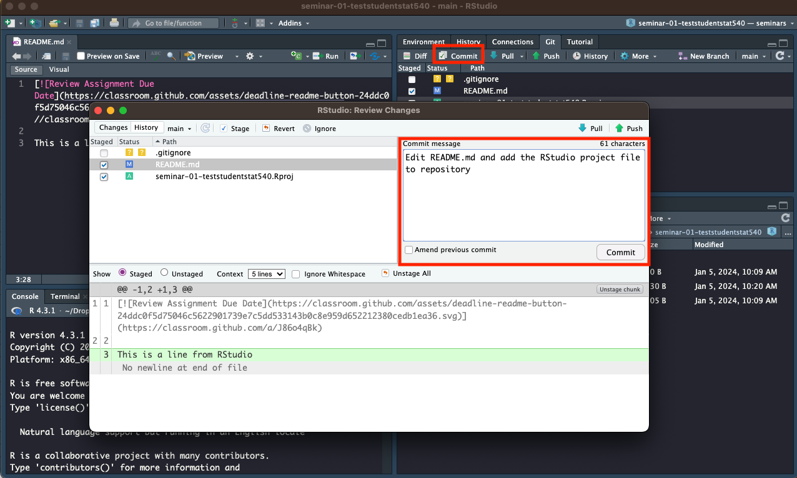

Go to your repository page on [GitHub](https://github.com/). Notice that
the new files are not yet on GitHub. Surprised?

**IMPORTANT NOTE!! The changes are NOT on GitHub yet. They have NOT been
published. Commit is an operation that happens solely on your local
repository.** This allows you to create a record of changes while being
offline. This also shields you from complications that may arise when
merging with the remote repository (until you decide to push). This is
something that confuses a lot of beginners. Take a moment to think about
this. If in doubt, ask a TA and clarify.

### Push

Push is the operation to bring the remote repository hosted on GitHub up
to date with your local changes. Normally, you might have accumulated
one or more commits in your local repository that you’re ready to
publish. All of these commits can be pushed with one “push” operation.

Now we will push the one commit we made with the addition of the
README.md and .Rproj files.

Do this by clicking the green ‘Up’ arrow (or Tools->Version
Control->Push Branch).

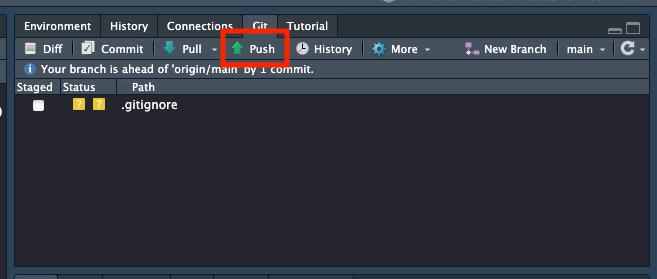

You should see this pop-up in RStudio.

    >>> git push origin HEAD:refs/heads/main
    To https://github.com/STAT540-UBC-2022/seminar-01-teststudentstat540.git
     * [new branch]      HEAD -> main

Now, go back to your repository page on [GitHub](https://github.com/).
This is what you should see.


Notice that the content of README.md is displayed directly on the
repository’s home page!

Take a moment to browse through GitHub’s user interface. You can
navigate through the files and their contents. You can also look at the
commit history by clicking on “commit”. In addition, GitHub supports a
range of project management features including issues, wiki pages, and
contribution statistics. You will inevitably learn more and you gain
more experience!

Keep in mind that if someone else wants to clone your repository, an
owner (in the case of assignments that is you or a teaching team member)
must first add the individual(s) to the collaborators list in order for
them to have access. This is because the repo is private to only you and
the teaching team. This is done by going to ‘Settings’ - see below.


### Pull

Finally, we want to demo the pull operation. We will make a change
directly on GitHub. *Don’t actually do this in practice (see note
below)*. This is just an illustration to show how we could pull in
changes to files that were made somewhere else than on your local
machine. This simulates the situation where your group member pushes a
new change that you don’t currently have. In order to sync up, you’ll
perform a “pull” from the remote repository into your local repository.

To make a change directly on GitHub, go to your repository page, click
on the file README.md. On top right of the file, there should be a
pencil icon.

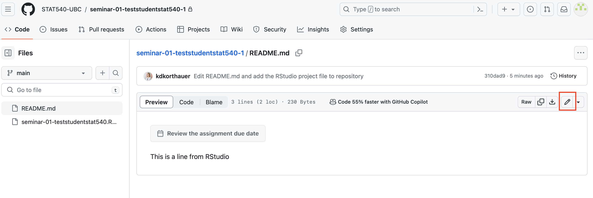

Click on the pencil. Add this line to README.md: “This change was made
directly on GitHub.” Put in a commit message and commit directly to the
“main” branch. Now you should see this.

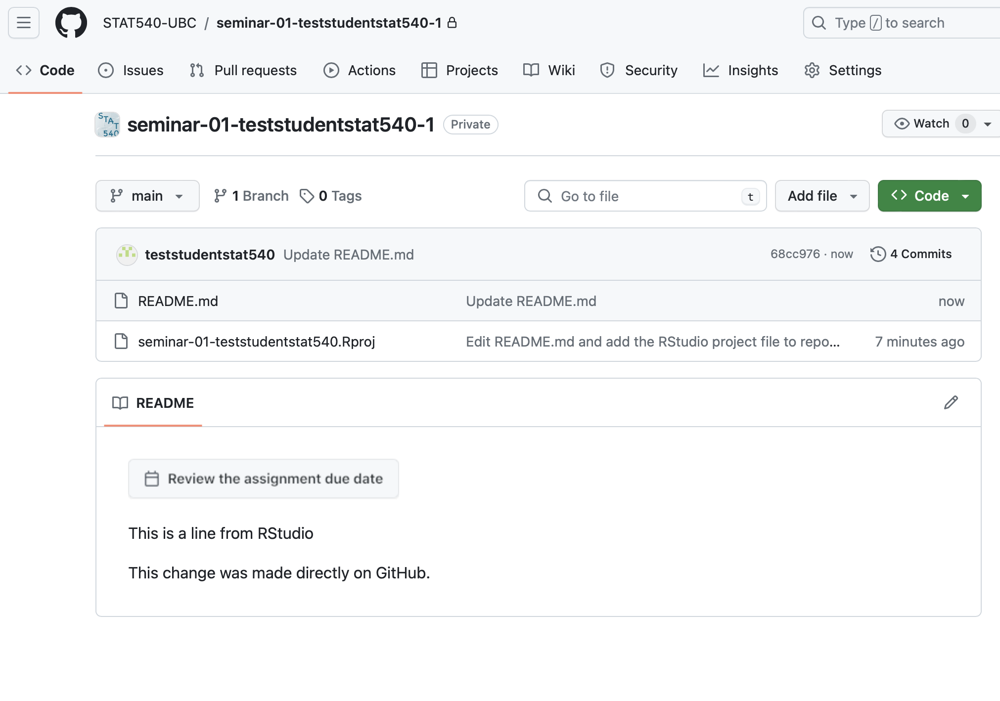

Check that your local version of the file still only contains the single
line: “This is a line from RStudio”.

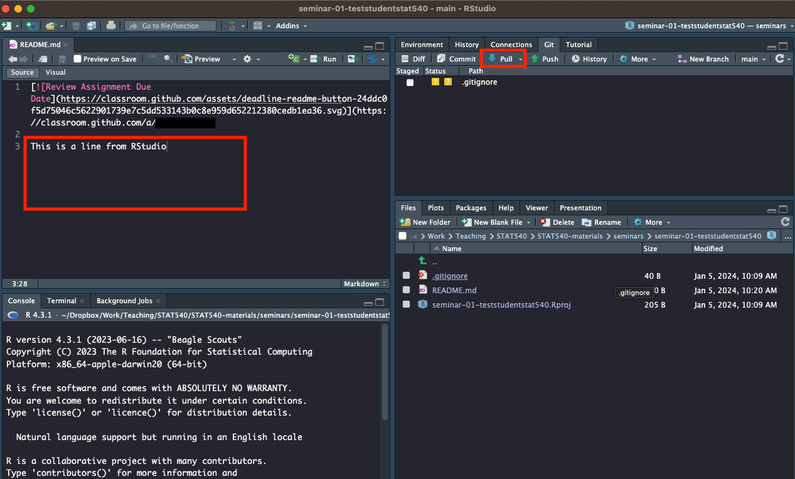

Click the blue down arrow in the Git pane (or click Tools->Version
Control->Pull Branches). And….. Voila!


**IMPORTANT NOTE** - Note that we recommend against making extensive
changes directly on GitHub. The browser is an unreliable environment
compared to RStudio’s built-in text editor. In addition, this is an easy
way to introduce code conflicts in case you have uncommitted changes in
your local repository. This was done here only for the sake of
demonstration. So don’t actually do this in practice!!

### About .gitignore

Oh yeah, that .gitignore file that we have ignored so far.

Go ahead and take a look at the content of this file now. You should see
the following:

``` r
.Rproj.user
.Rhistory
.RData
.Ruserdata
```

This is basically telling Git to ignore all these files in the list.
This may come in handy when you start working on your project. The
datasets that you will work with may be \>100 MB in size, which exceeds
GitHub’s per file limit. You may still want to keep the data files
inside your project directory for easy access. In this case, you can add
those filenames to this .gitignore file so that Git doesn’t bug you
about these “unstaged changes”. Or, you can add all files with a certain
extension using a wildcard. For example, if we wanted to make sure we
don’t commit data in txt files, we could add the line `*.txt` to our
.gitignore file. GitHub keeps up a set of commonly used .gitignore files
as well as more information about their usage
[here](https://github.com/github/gitignore).

## Part 4: Deliverables

If you’re still with us, and you’ve made the two commits to the README
file in your assignment repo (one by pushing from your local machine,
and another by committing directly from GitHub), then you’re done!
That’s it. There’s no extra submit button. Just make sure you complete
these two commits (**and push** - verify that you can see them on GitHub
like below, otherwise we won’t be able to see them) by the deadline. The
TAs will mark the repos based on the latest commit that occurred before
the deadline (this tag is auto-generated). Any commits after the
deadline will be ignored (not marked).


## Final notes and some additional resources

Final recommendations (excerpt from [Ch. 26 of Happy Git and GitHub for
the useR](http://happygitwithr.com/burn.html)):

-   Commit early and often.
-   Push to a remote, like GitHub, often.
-   The state of things on GitHub is your new “worst case scenario”.
-   If you really screw things up locally, copy all the files (or the
    ones that have changed) to a safe place.
-   Usually your files are JUST FINE. But it is easy to goof up the Git
    infrastructure when you’re new at this. And it can be hard to get
    that straightened out on your own.
-   Rename the existing local repo as a temporary measure, i.e. before
    you do something radical, like delete it.
-   Clone the repo from GitHub to your local machine. You are back to a
    happy state.
-   Copy all relevant files back over from your safe space. The ones
    whose updated state you need to commit.
-   Stage and commit. Push.
-   Carry on with your life.

Here are some resources in case you want to learn more.

-   [Happy Git and GitHub for the useR](http://happygitwithr.com/) by
    [Dr. Jenny Bryan](https://github.com/jennybc)
-   [Git Documentations](https://git-scm.com/documentation)

## Attributions

This seminar was oringally developed by [Eric
Chu](https://github.com/echu113) with materials adapted from [Happy Git
and GitHub for the useR](http://happygitwithr.com/) by [Dr. Jenny
Bryan](https://github.com/jennybc). It was later modified extensively by
Keegan Korthauer.
